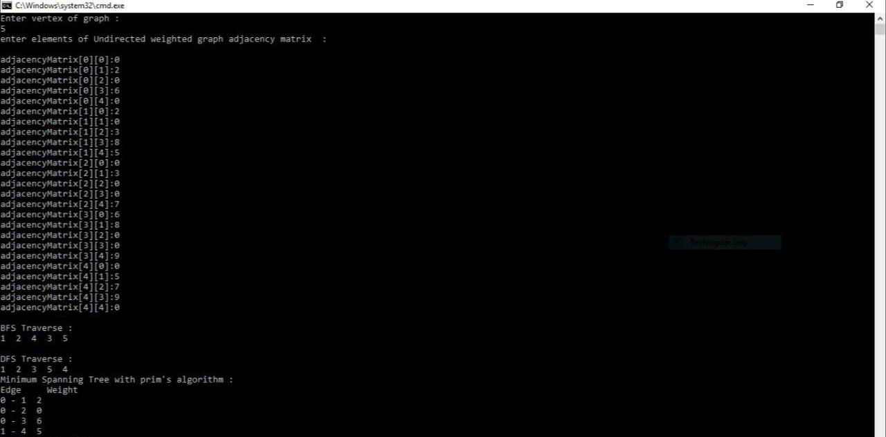

# BFS-and-DFS-Traversal--and-Minimum-Spanning-Tree-on-Wieghted-Graph

My 1st project was in "Algorithms Analysis and Design" course when I was in the 4th semester of my bachelor's at IAUSTB. This program performs BFS and DFS traversal on weighted graphs and finding MST on them.

## Output
|  | 
|:--:| 
| *Output*

