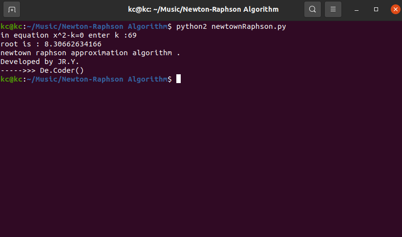

# Huffman-Algorithm-with-Hash-Table

My 6th project was in "Algorithms Analysis and Design" course when I was in the 4th semester of my bachelor's at IAUSTB. This program is an implementation of Huffman's algorithm with Hash Table.

## Output
|  | 
|:--:| 
| *Output*

