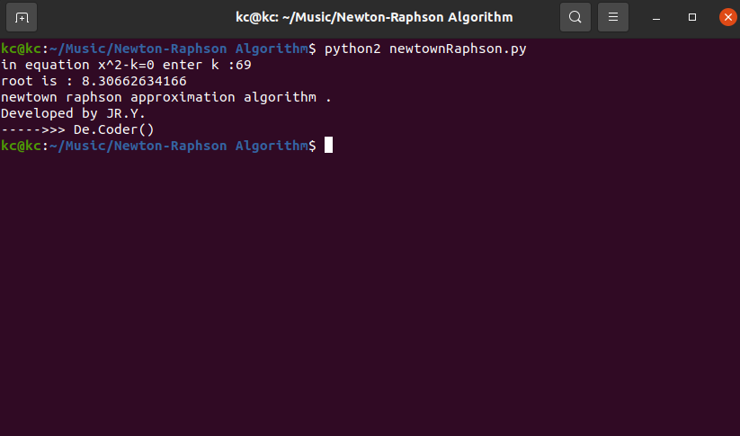

# Newton-Raphson Algorithm

My 3rd project was in the "Algorithms Analysis and Design" course when I was in the 4th semester of my bachelor's at IAUSTB. This program calculates approximately the root of a linear equation

## Iteration typically improves the approximation
|  | 
|:--:| 
| *Newton-Raphson method*

## Output
|  | 
|:--:| 
| *Output*

