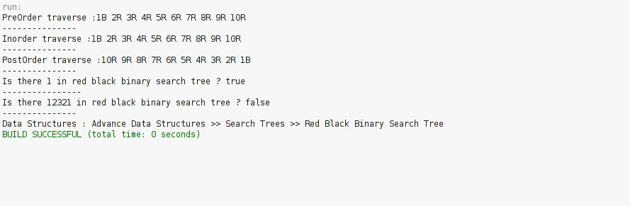

# Red-Black-Tree-Traversal

My 5th project was in "Algorithms Analysis and Design" course when I was in the 4th semester of my bachelor's at IAUSTB. This program performs Inorder, Preorder, and Postorder Traversal on a Red-Black Tree.

## Output
|  | 
|:--:| 
| *Output*

