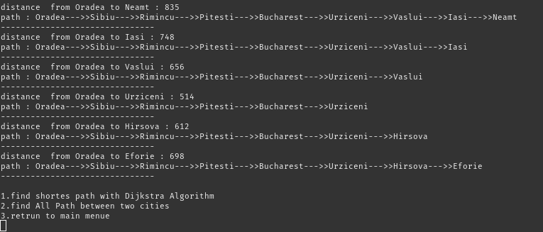

# Routing-in-Non-Negative-Weighted-Directed-and-Undirected-Graphs

My final project was in the "Algorithms Analysis and Design" course when I was in the 4th semester of my bachelor's at IAUSTB. This program finds and prints the shortest path between nodes and all shortest paths between two nodes in ascending in a non-negative weighted directed or undirected graph. 

* employed priority queue to increase algorithm performance 

* implemented priority queue with min heap tree

* used Stack to store all paths between two nodes

* used merge sort algorithm for sorting all simple paths between two nodes

## find shortes path with Dijkstra Algorithm output
|  | 
|:--:| 
| *part A*

## find shortes path with Dijkstra Algorithm output
|  | 
|:--:| 
| *part B*

## find All Path between two cities
|  | 
|:--:| 
| *output*

## routing algorithm comparison
|  | 
|:--:| 
| *table*

## routing algorithm applications
|  | 
|:--:| 
| *table*
