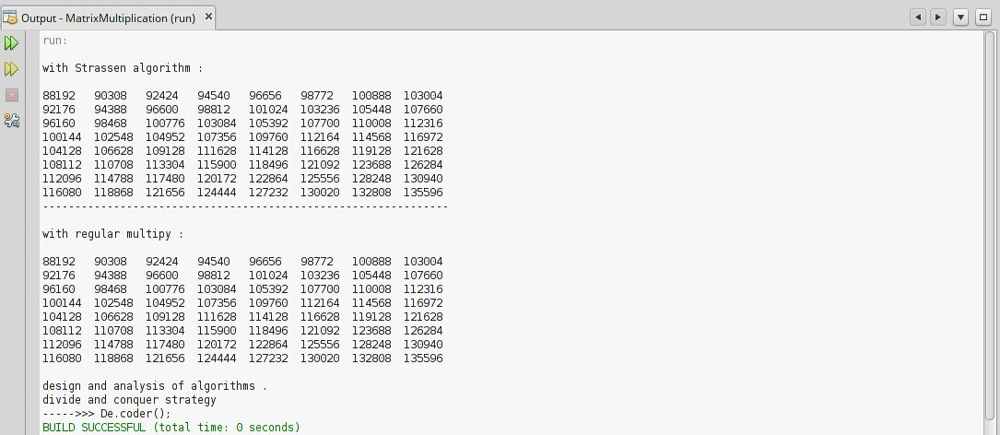

# Strassen-Matrix-Multiplication

My 4th project was in the "Algorithms Analysis and Design" course when I was in the 4th semester of my bachelor's at IAUSTB. This program performs Multiplication on 2 matrices with regular and Strassen's algorithms.

## Output
|  | 
|:--:| 
| *Output*

