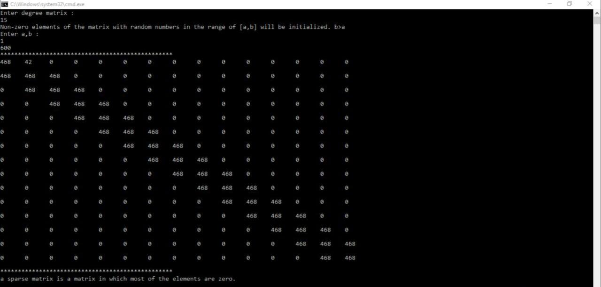

# Tridiagonal-Sparse-Matrix

My 2nd project was in the "Algorithms Analysis and Design" course when I was in the 4th semester of my bachelor's at IAUSTB. This program generates an n*n Tridiagonal Sparse Matrix with a random number between [a,b] for its non-zero elements.

## Output
|  | 
|:--:| 
| *Output*

